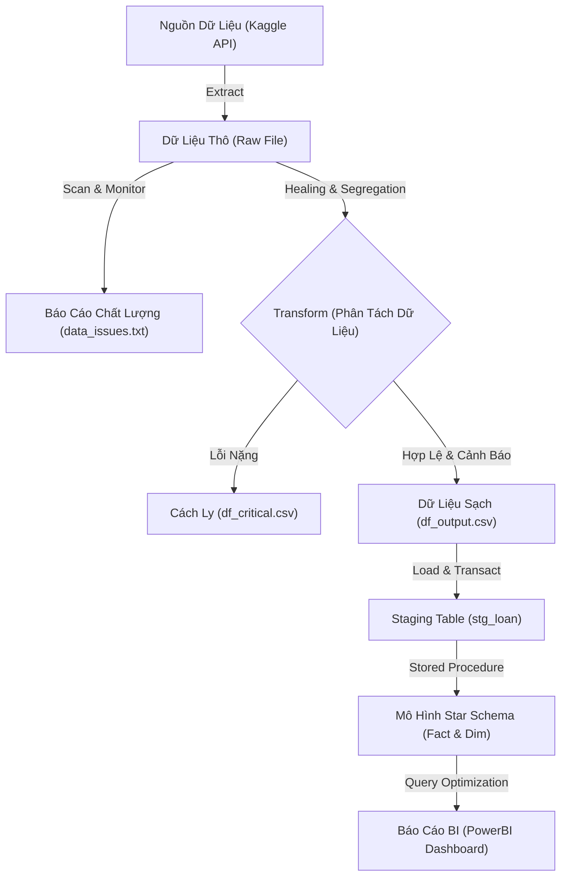

# Đồ Án Tốt Nghiệp: Hệ Thống Phân Tích Rủi Ro Tín Dụng

Chào mừng bạn đến với kho lưu trữ mã nguồn của dự án **Hệ thống chấm điểm rủi ro tín dụng**. Đây là đồ án tốt nghiệp thiết kế và xây dựng một quy trình ELT (Extract - Load - Transform) khép kín phục vụ tích hợp, chuẩn hóa dữ liệu lớn về rủi ro tín dụng và cấu trúc kho dữ liệu phục vụ báo cáo quản trị thông minh (BI).

---

## 📌 Tổng Quan Dự Án
Dự án giải quyết bài toán xử lý dữ liệu thô từ nguồn Kaggle, thực hiện kiểm soát chất lượng dữ liệu (Data Quality) nghiêm ngặt thông qua các bộ quy tắc nghiệp vụ định nghĩa bằng cấu hình, tự động sửa lỗi và điền khuyết dữ liệu (Data Healing), phân tách dữ liệu lỗi, nạp vào SQL Server và tự động phân bổ vào mô hình Star Schema (gồm bảng Fact và các bảng Dimension) được tối ưu hóa cho Data Warehouse.

---

## 🚀 Các Giai Đoạn & Tính Năng Cốt Lõi

Hệ thống được tổ chức theo quy trình **ELT** (Extract - Transform - Load):

### 1. Extract (Trích Xuất & Giám Sát)
*   Tích hợp Kaggle API để tự động tải tệp dữ liệu rủi ro tín dụng thô từ đám mây về thư mục `data/raw/`.
*   Tích hợp công cụ **Data Quality Validator** quét qua dữ liệu và phát hiện các trường hợp vi phạm quy tắc nghiệp vụ.
*   Tự động xuất báo cáo chất lượng dữ liệu chi tiết tại `docs/03_notes/engineering/data_issues.txt`.

### 2. Transform (Biến Đổi & Sửa Lỗi Tự Động)
*   **Data Healing (Điền khuyết tự động):**
    *   Tự động điền số năm làm việc (`person_emp_length`) bị thiếu bằng giá trị trung vị (median) theo nhóm tuổi của khách hàng.
    *   Tự động điền lãi suất khoản vay (`loan_int_rate`) bị thiếu bằng giá trị trung vị theo hạng tín dụng (`loan_grade`).
*   **Phân tách dữ liệu (Data Segregation):**
    *   **PASS & WARNING:** Các bản ghi hợp lệ hoặc lỗi nhẹ được lưu trữ tại `data/output/df_output.csv`.
    *   **CRITICAL:** Các bản ghi vi phạm logic nghiêm trọng (như tuổi < 18, số tiền vay âm) sẽ bị cách ly ra file riêng để phục vụ kiểm toán và gán cờ rủi ro.

### 3. Load (Tải Nạp & Chuẩn Hóa Kho Dữ Liệu)
*   Nạp dữ liệu sạch vào bảng tạm **Staging (`stg_loan`)** của SQL Server với tốc độ tối ưu nhờ cấu hình `fast_executemany` và cơ chế `TRUNCATE` giảm thiểu ghi log.
*   Tự động kích hoạt Stored Procedure `sp_load_star_schema` để chia nhỏ và ánh xạ dữ liệu sang mô hình Star Schema:
    *   Bảng sự kiện chính: `FactLoan`
    *   Các bảng chiều: `DimCustomer`, `DimLocation`, `DimLoanPurpose`, `DimLoanGrade`.
*   Cơ sở dữ liệu được cấu hình tối ưu hóa cho Data Warehouse (SIMPLE Recovery, RCSI, Clustered Columnstore Index trên Fact table) nhằm đảm bảo hiệu năng tối đa cho PowerBI.

---

## 🛠️ Công Nghệ Sử Dụng
*   **Ngôn ngữ lập trình:** Python 3.10+
*   **Thư viện phân tích & xử lý:** Pandas, Numpy
*   **Quản lý cơ sở dữ liệu:** SQL Server (SSMS), SQLAlchemy, PyODBC
*   **Nguồn dữ liệu & Cloud:** Kaggle API
*   **Công cụ biểu diễn:** PowerBI / SSAS (Star Schema)

---

## 📂 Hướng Dẫn Cấu Trúc Thư Mục
Để xem cấu trúc chi tiết của các tệp nguồn và tài liệu kỹ thuật, vui lòng tham khảo tệp cấu trúc dự án:
👉 **[project_structure.md](file:///c:/Users/OMEN/Desktop/Learn/FPT/DATN/project_structure.md)**

---

## 📋 Khởi Chạy Nhanh Dự Án
Các chỉ dẫn cài đặt thư viện, cấu hình môi trường ảo, kết nối cơ sở dữ liệu và lệnh khởi chạy pipeline đã được chuyển toàn bộ sang:
👉 **[QUICKSTART.md](file:///c:/Users/OMEN/Desktop/Learn/FPT/DATN/QUICKSTART.md)**
*(Bao gồm phiên bản tiếng Anh và tiếng Việt được chia tab trực quan trên GitHub)*
