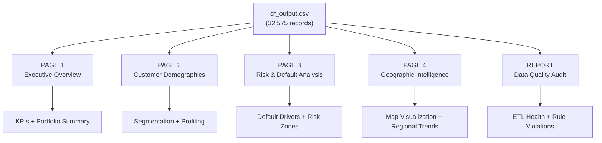
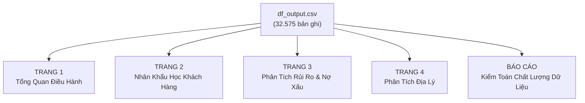

# Credit Risk Dashboard & Report Proposal

Based on the [df_output.csv](file:///c:/Users/OMEN/Desktop/Learn/FPT/DATN/data/output/df_output.csv) dataset (32,575 loan application records, 31 columns), the following dashboard system is proposed.

---

## Dashboard Architecture

---

## PAGE 1: Executive Overview

**Purpose:** Provide senior leadership with a single-glance summary of the entire loan portfolio's health and performance.

### KPI Cards (Top Row)
| KPI | Formula | Column(s) Used |
|-----|---------|----------------|
| Total Loan Volume | `SUM(loan_amnt)` | `loan_amnt` |
| Total Applications | `COUNT(client_ID)` | `client_ID` |
| Average Interest Rate | `AVG(loan_int_rate)` | `loan_int_rate` |
| Overall Default Rate | `SUM(loan_status) / COUNT(*) × 100` | `loan_status` |
| Average Loan-to-Income | `AVG(loan_percent_income)` | `loan_percent_income` |

### Visuals

| # | Chart Type | X-Axis / Category | Y-Axis / Value | Color / Legend | Insight |
|---|------------|-------------------|----------------|---------------|---------|
| 1 | **Treemap** | `loan_intent` | `SUM(loan_amnt)` | Shade by default rate | Which loan purposes carry the most capital and risk |
| 2 | **Clustered Column** | `loan_grade` (A→G) | `SUM(loan_amnt)` + line for `AVG(loan_int_rate)` | — | Interest rate escalation across credit grades |
| 3 | **Donut Chart** | `loan_term_months` | `COUNT(client_ID)` | — | Distribution of short-term (12m) vs. long-term (36m) loans |
| 4 | **Stacked Bar** | `person_home_ownership` | `COUNT(client_ID)` | Split by `loan_status` (0/1) | Default concentration by housing situation |

### Slicers
`country`, `loan_grade`, `employment_type`, `loan_term_months`

---

## PAGE 2: Customer Demographics & Profiling

**Purpose:** Help Product & Marketing teams understand who the borrowers are, enabling targeted campaigns and product design.

### KPI Cards
| KPI | Formula | Column(s) Used |
|-----|---------|----------------|
| Average Customer Age | `AVG(person_age)` | `person_age` |
| Average Annual Income | `AVG(person_income)` | `person_income` |
| Average Employment Length | `AVG(person_emp_length)` | `person_emp_length` |
| Proportion with Default History | `COUNTIF(cb_person_default_on_file='Y') / COUNT(*)` | `cb_person_default_on_file` |

### Visuals

| # | Chart Type | X-Axis / Category | Y-Axis / Value | Color / Legend | Insight |
|---|------------|-------------------|----------------|---------------|---------|
| 1 | **Histogram** | `person_age` (binned) | `COUNT(client_ID)` | Split by `gender` | Age distribution and gender balance of applicants |
| 2 | **Scatter Plot** | `person_age` | `person_income` | Color by `education_level`, size by `loan_amnt` | Income growth trajectory by age and education |
| 3 | **Grouped Bar** | `education_level` | `AVG(person_income)` | Split by `gender` | Income gap analysis across education levels |
| 4 | **100% Stacked Bar** | `employment_type` | `COUNT(client_ID)` | Split by `marital_status` | Employment-marital profile of the customer base |
| 5 | **Matrix / Heatmap** | Rows: `person_home_ownership` | Cols: `education_level` | Values: `AVG(loan_amnt)` | Borrowing patterns by lifestyle segment |

### Slicers
`gender`, `marital_status`, `education_level`, `person_home_ownership`

---

## PAGE 3: Risk & Default Analysis

**Purpose:** Equip the Risk Management team with tools to identify default drivers, set credit policy thresholds, and monitor portfolio risk concentration.

### KPI Cards
| KPI | Formula | Column(s) Used |
|-----|---------|----------------|
| Default Rate | `SUM(loan_status) / COUNT(*) × 100` | `loan_status` |
| Average DTI (Debt-to-Income) | `AVG(debt_to_income_ratio)` | `debt_to_income_ratio` |
| Average Credit Utilization | `AVG(credit_utilization_ratio)` | `credit_utilization_ratio` |
| Avg. Past Delinquencies | `AVG(past_delinquencies)` | `past_delinquencies` |

### Visuals

| # | Chart Type | X-Axis / Category | Y-Axis / Value | Color / Legend | Insight |
|---|------------|-------------------|----------------|---------------|---------|
| 1 | **Line Chart** | `debt_to_income_ratio` (binned: 0-0.2, 0.2-0.4, …) | Default Rate % | — | **Critical:** Find the DTI threshold where default rate spikes |
| 2 | **Bubble Chart** | `loan_percent_income` | `loan_int_rate` | Size: `loan_amnt`, Color: `loan_status` | Visual risk map — large red bubbles = high-risk, high-value defaults |
| 3 | **Grouped Column** | `loan_grade` | `COUNT(client_ID)` | Split by `loan_status` (Default vs. Paid) | Default rate comparison across credit grades |
| 4 | **Box Plot** | `loan_status` (0 vs 1) | `credit_utilization_ratio` | — | Distribution comparison: do defaulters have higher utilization? |
| 5 | **Waterfall / Funnel** | `past_delinquencies` (0, 1, 2, 3+) | Default Rate % | — | How past behavior predicts future default |
| 6 | **Correlation Matrix** | Numeric columns | Numeric columns | Heatmap color | Identify which financial metrics are most correlated with default |

> [!IMPORTANT]
> The **Line Chart (#1)** and **Bubble Chart (#2)** are the most strategically valuable visuals. They directly answer the question: *"At what financial threshold does a borrower become too risky to approve?"*

### Slicers
`loan_grade`, `cb_person_default_on_file`, `loan_intent`

---

## PAGE 4: Geographic Intelligence

**Purpose:** Reveal regional lending patterns, enabling location-based strategy (branch planning, regional risk assessment, marketing budget allocation).

### Visuals

| # | Chart Type | Data Source | Insight |
|---|------------|------------|---------|
| 1 | **Filled Map / Choropleth** | `country`, `state` → color by `AVG(loan_int_rate)` or Default Rate | Which regions have the highest interest rates or default risk |
| 2 | **Bubble Map** | `city_latitude`, `city_longitude` → size by `SUM(loan_amnt)`, color by Default Rate | Pinpoint high-volume, high-risk cities |
| 3 | **Bar Chart (Top 10)** | Top 10 cities by `COUNT(client_ID)` | Most active lending markets |
| 4 | **Table with Conditional Formatting** | Group by `country` + `state`: show `COUNT`, `SUM(loan_amnt)`, `AVG(loan_int_rate)`, Default Rate | Detailed regional performance breakdown |

### Slicers
`country`, `state`, `city`

---

## OPERATIONAL REPORT: Data Quality Audit

**Purpose:** Monitor ETL pipeline health. Source data from the auto-generated [data_issues.txt](file:///c:/Users/OMEN/Desktop/Learn/FPT/DATN/docs/03_notes/engineering/data_issues.txt).

### Report Content

| Section | Visual | Data |
|---------|--------|------|
| Quality Score | **Gauge Chart** | Pass Rate: 79.49%, Warning: 20.49%, Critical: 0.02% |
| Rule Violations | **Horizontal Bar Chart** | Count of violations per Rule ID (R1, R2, R3, R8, R9, R19) |
| Missing Values | **KPI Cards** | Post-imputation status for `person_emp_length` and `loan_int_rate` |
| Quarantine List | **Data Table** | Detailed list of Critical records with Client_ID and violation descriptions |

---
---

# Đề Xuất Dashboard & Báo Cáo Phân Tích Rủi Ro Tín Dụng (Bản Tiếng Việt)

Dựa trên tệp dữ liệu [df_output.csv](file:///c:/Users/OMEN/Desktop/Learn/FPT/DATN/data/output/df_output.csv) (32.575 bản ghi hồ sơ vay vốn, 31 cột), hệ thống Dashboard sau đây được đề xuất.

---

## Kiến Trúc Dashboard

---

## TRANG 1: Tổng Quan Điều Hành

**Mục tiêu:** Cung cấp cho Ban Giám đốc cái nhìn tổng thể về sức khỏe và hiệu suất của toàn bộ danh mục cho vay chỉ trong một màn hình.

### Thẻ KPI (Hàng trên cùng)
| Chỉ số | Công thức | Cột sử dụng |
|--------|-----------|-------------|
| Tổng dư nợ cho vay | `SUM(loan_amnt)` | `loan_amnt` |
| Tổng số hồ sơ | `COUNT(client_ID)` | `client_ID` |
| Lãi suất trung bình | `AVG(loan_int_rate)` | `loan_int_rate` |
| Tỷ lệ nợ xấu tổng thể | `SUM(loan_status) / COUNT(*) × 100` | `loan_status` |
| Tỷ lệ vay/Thu nhập trung bình | `AVG(loan_percent_income)` | `loan_percent_income` |

### Biểu đồ

| # | Loại biểu đồ | Trục X / Nhóm | Trục Y / Giá trị | Màu sắc / Chú thích | Thông tin khai thác |
|---|--------------|---------------|-------------------|---------------------|---------------------|
| 1 | **Treemap** | `loan_intent` | `SUM(loan_amnt)` | Tô đậm theo tỷ lệ nợ xấu | Mục đích vay nào chiếm nhiều vốn và rủi ro nhất |
| 2 | **Cột nhóm (Clustered Column)** | `loan_grade` (A→G) | `SUM(loan_amnt)` + đường cho `AVG(loan_int_rate)` | — | Lãi suất leo thang theo hạng tín dụng |
| 3 | **Donut** | `loan_term_months` | `COUNT(client_ID)` | — | Phân bổ khoản vay ngắn hạn (12 tháng) và dài hạn (36 tháng) |
| 4 | **Cột chồng (Stacked Bar)** | `person_home_ownership` | `COUNT(client_ID)` | Chia theo `loan_status` (0/1) | Nợ xấu tập trung ở nhóm sở hữu nhà nào |

### Bộ lọc tương tác
`country` (Quốc gia), `loan_grade` (Hạng tín dụng), `employment_type` (Loại hình công việc), `loan_term_months` (Kỳ hạn vay)

---

## TRANG 2: Nhân Khẩu Học & Chân Dung Khách Hàng

**Mục tiêu:** Giúp phòng Sản phẩm & Marketing hiểu rõ người đi vay là ai, từ đó thiết kế chiến dịch và sản phẩm phù hợp.

### Thẻ KPI
| Chỉ số | Công thức | Cột sử dụng |
|--------|-----------|-------------|
| Tuổi trung bình | `AVG(person_age)` | `person_age` |
| Thu nhập trung bình/năm | `AVG(person_income)` | `person_income` |
| Số năm làm việc trung bình | `AVG(person_emp_length)` | `person_emp_length` |
| Tỷ lệ từng có nợ xấu | `COUNTIF(cb_person_default_on_file='Y') / COUNT(*)` | `cb_person_default_on_file` |

### Biểu đồ

| # | Loại biểu đồ | Trục X / Nhóm | Trục Y / Giá trị | Màu sắc / Chú thích | Thông tin khai thác |
|---|--------------|---------------|-------------------|---------------------|---------------------|
| 1 | **Histogram** | `person_age` (phân nhóm) | `COUNT(client_ID)` | Chia theo `gender` | Phân bổ độ tuổi và cân bằng giới tính |
| 2 | **Phân tán (Scatter)** | `person_age` | `person_income` | Màu theo `education_level`, kích thước theo `loan_amnt` | Quỹ đạo tăng trưởng thu nhập theo tuổi và học vấn |
| 3 | **Cột nhóm (Grouped Bar)** | `education_level` | `AVG(person_income)` | Chia theo `gender` | Phân tích khoảng cách thu nhập theo trình độ học vấn |
| 4 | **Cột chồng 100%** | `employment_type` | `COUNT(client_ID)` | Chia theo `marital_status` | Hồ sơ việc làm - hôn nhân của nhóm khách hàng |
| 5 | **Ma trận nhiệt (Heatmap)** | Hàng: `person_home_ownership` | Cột: `education_level` | Giá trị: `AVG(loan_amnt)` | Xu hướng vay theo phân khúc lối sống |

### Bộ lọc tương tác
`gender` (Giới tính), `marital_status` (Hôn nhân), `education_level` (Học vấn), `person_home_ownership` (Sở hữu nhà)

---

## TRANG 3: Phân Tích Rủi Ro & Nợ Xấu

**Mục tiêu:** Trang bị cho bộ phận Quản trị rủi ro công cụ nhận diện các yếu tố dẫn đến nợ xấu, thiết lập ngưỡng chính sách tín dụng và giám sát mức độ tập trung rủi ro.

### Thẻ KPI
| Chỉ số | Công thức | Cột sử dụng |
|--------|-----------|-------------|
| Tỷ lệ nợ xấu | `SUM(loan_status) / COUNT(*) × 100` | `loan_status` |
| Tỷ lệ nợ/Thu nhập trung bình (DTI) | `AVG(debt_to_income_ratio)` | `debt_to_income_ratio` |
| Tỷ lệ sử dụng hạn mức trung bình | `AVG(credit_utilization_ratio)` | `credit_utilization_ratio` |
| Số lần trễ hạn trung bình | `AVG(past_delinquencies)` | `past_delinquencies` |

### Biểu đồ

| # | Loại biểu đồ | Trục X / Nhóm | Trục Y / Giá trị | Màu sắc / Chú thích | Thông tin khai thác |
|---|--------------|---------------|-------------------|---------------------|---------------------|
| 1 | **Đường (Line)** | `debt_to_income_ratio` (phân nhóm: 0-0.2, 0.2-0.4, …) | Tỷ lệ nợ xấu % | — | **Quan trọng:** Tìm ngưỡng DTI mà tỷ lệ vỡ nợ tăng vọt |
| 2 | **Bong bóng (Bubble)** | `loan_percent_income` | `loan_int_rate` | Kích thước: `loan_amnt`, Màu: `loan_status` | Bản đồ rủi ro trực quan — bong bóng đỏ lớn = nợ xấu giá trị cao |
| 3 | **Cột nhóm** | `loan_grade` | `COUNT(client_ID)` | Chia theo `loan_status` (Vỡ nợ vs. Trả tốt) | So sánh tỷ lệ nợ xấu giữa các hạng tín dụng |
| 4 | **Hộp (Box Plot)** | `loan_status` (0 vs 1) | `credit_utilization_ratio` | — | Người vỡ nợ có sử dụng hạn mức cao hơn không? |
| 5 | **Phễu (Waterfall/Funnel)** | `past_delinquencies` (0, 1, 2, 3+) | Tỷ lệ nợ xấu % | — | Hành vi quá khứ dự báo nợ xấu tương lai như thế nào |
| 6 | **Ma trận tương quan** | Các cột số | Các cột số | Nhiệt sắc (Heatmap) | Xác định chỉ số tài chính nào tương quan mạnh nhất với nợ xấu |

> [!IMPORTANT]
> **Biểu đồ Đường (#1)** và **Biểu đồ Bong bóng (#2)** là hai biểu đồ có giá trị chiến lược cao nhất. Chúng trả lời trực tiếp câu hỏi: *"Ở ngưỡng tài chính nào thì người vay trở nên quá rủi ro để phê duyệt?"*

### Bộ lọc tương tác
`loan_grade` (Hạng tín dụng), `cb_person_default_on_file` (Lịch sử nợ xấu), `loan_intent` (Mục đích vay)

---

## TRANG 4: Phân Tích Địa Lý

**Mục tiêu:** Phát hiện xu hướng cho vay theo vùng miền, hỗ trợ chiến lược mở chi nhánh, đánh giá rủi ro khu vực và phân bổ ngân sách marketing.

### Biểu đồ

| # | Loại biểu đồ | Nguồn dữ liệu | Thông tin khai thác |
|---|--------------|---------------|---------------------|
| 1 | **Bản đồ Choropleth** | `country`, `state` → tô màu theo `AVG(loan_int_rate)` hoặc Tỷ lệ nợ xấu | Khu vực nào có lãi suất hoặc rủi ro nợ xấu cao nhất |
| 2 | **Bản đồ Bong bóng** | `city_latitude`, `city_longitude` → kích thước theo `SUM(loan_amnt)`, màu theo Tỷ lệ nợ xấu | Xác định chính xác các thành phố có dư nợ lớn và rủi ro cao |
| 3 | **Biểu đồ Cột (Top 10)** | Top 10 thành phố theo `COUNT(client_ID)` | Các thị trường cho vay sôi động nhất |
| 4 | **Bảng có định dạng điều kiện** | Nhóm theo `country` + `state`: hiển thị `COUNT`, `SUM(loan_amnt)`, `AVG(loan_int_rate)`, Tỷ lệ nợ xấu | Phân tích hiệu suất chi tiết theo khu vực |

### Bộ lọc tương tác
`country` (Quốc gia), `state` (Bang/Tỉnh), `city` (Thành phố)

---

## BÁO CÁO VẬN HÀNH: Kiểm Toán Chất Lượng Dữ Liệu

**Mục tiêu:** Giám sát sức khỏe của đường ống ETL. Nguồn dữ liệu từ file [data_issues.txt](file:///c:/Users/OMEN/Desktop/Learn/FPT/DATN/docs/03_notes/engineering/data_issues.txt) được tự động sinh ra.

### Nội dung báo cáo

| Mục | Biểu đồ | Dữ liệu |
|-----|---------|---------|
| Điểm Chất lượng | **Đồng hồ đo (Gauge)** | Tỷ lệ Đạt: 79.49%, Cảnh báo: 20.49%, Nghiêm trọng: 0.02% |
| Vi phạm quy tắc | **Cột ngang (Horizontal Bar)** | Số lượng vi phạm theo từng Rule ID (R1, R2, R3, R8, R9, R19) |
| Giá trị khuyết thiếu | **Thẻ KPI** | Trạng thái sau xử lý cho `person_emp_length` và `loan_int_rate` |
| Danh sách cách ly | **Bảng dữ liệu (Data Table)** | Danh sách chi tiết các bản ghi Critical kèm Client_ID và mô tả lỗi |

---

## Tổng Kết Cột Dữ Liệu Sử Dụng

| Trang | Cột chính được sử dụng |
|-------|----------------------|
| Trang 1 - Tổng quan | `loan_amnt`, `client_ID`, `loan_int_rate`, `loan_status`, `loan_intent`, `loan_grade`, `loan_term_months`, `person_home_ownership` |
| Trang 2 - Khách hàng | `person_age`, `person_income`, `person_emp_length`, `gender`, `marital_status`, `education_level`, `employment_type`, `person_home_ownership` |
| Trang 3 - Rủi ro | `loan_status`, `debt_to_income_ratio`, `credit_utilization_ratio`, `past_delinquencies`, `loan_percent_income`, `loan_int_rate`, `loan_grade`, `cb_person_default_on_file`, `open_accounts`, `other_debt` |
| Trang 4 - Địa lý | `country`, `state`, `city`, `city_latitude`, `city_longitude`, `loan_amnt`, `loan_status` |
| Báo cáo DQ | `status`, rule violation data from `data_issues.txt` |

> [!TIP]
> Toàn bộ 31 cột trong tệp `df_output.csv` đều được khai thác trong ít nhất một trang Dashboard. Không có cột dữ liệu nào bị bỏ phí.
