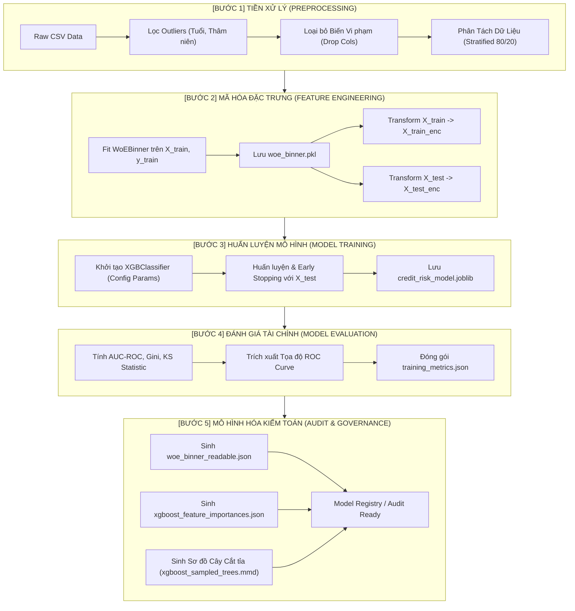
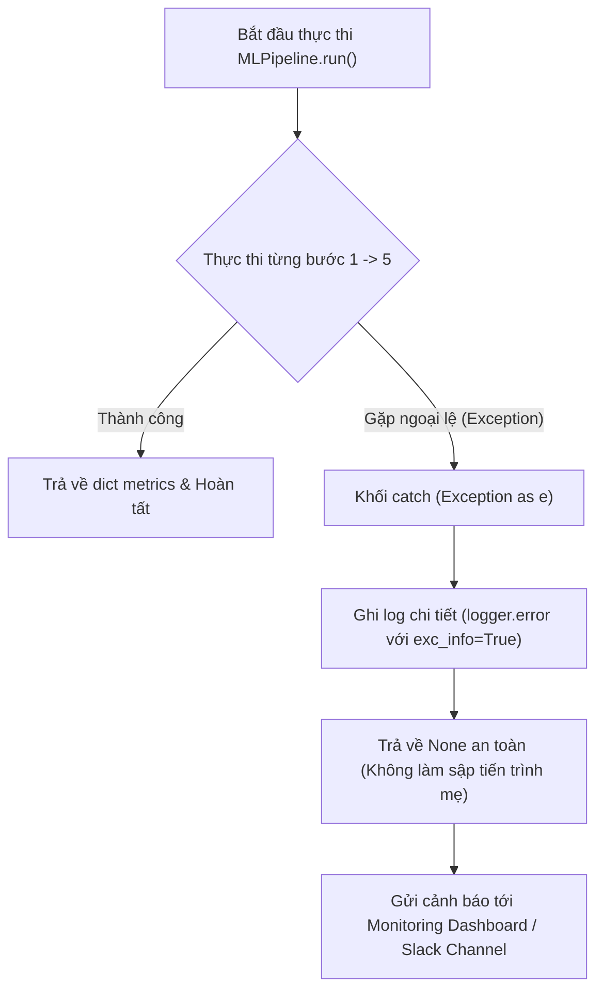

# TÀI LIỆU ĐẶC TẢ QUY TRÌNH XỬ LÝ DỮ LIỆU MACHINE LEARNING (ML DATA PIPELINE SPECIFICATION)
## KIẾN TRÚC ĐIỀU PHỐI END-TO-END PIPELINE CHO HỆ THỐNG QUẢN TRỊ RỦI RO TÍN DỤNG

---

### THÔNG TIN TÀI LIỆU (DOCUMENT CONTROL)

| Thuộc tính (Attribute) | Chi tiết (Details) |
| :--- | :--- |
| **Mã tài liệu (Document ID)** | `SPEC-ML-PIPE-2026-V1.0` |
| **Tên tài liệu** | End-to-End Machine Learning Data Processing & Training Pipeline Specification |
| **Tác giả (Author)** | Lead / Senior Business Analyst & Data Solutions Architect |
| **Mã nguồn lõi (Core Source)** | [`services/ml_engine/src/machine_learning/pipeline.py`](file:///c:/Users/OMEN/Desktop/Learn/FPT/DATN/services/ml_engine/src/machine_learning/pipeline.py) |
| **Phiên bản (Version)** | `1.0.0 (Production Ready)` |
| **Phạm vi áp dụng** | Batch Training, Automated Retraining, Model Registry, Audit & Governance |
| **Chuẩn mực đối chiếu** | BABOK v3, Basel II/III Model Validation, Fed SR 11-7, MLOps Standards |

---

## 1. TỔNG QUAN ĐIỀU HÀNH & NGUYÊN TẮC THIẾT KẾ (EXECUTIVE SUMMARY & DESIGN PRINCIPLES)

### 1.1. Mục Tiêu Cốt Lõi (Core Objective)
Phân hệ `MLPipeline` chịu trách nhiệm tự động hóa toàn bộ vòng đời huấn luyện và kiểm định mô hình Machine Learning theo cơ chế **Config-Driven Architecture (Kiến trúc Hướng Cấu hình)** và **OOP (Lập trình Hướng đối tượng)**. Pipeline kết nối liền mạch từ bước trích xuất dữ liệu thô, làm sạch, mã hóa đặc trưng Weight of Evidence (WoE), huấn luyện thuật toán XGBoost, đo lường chỉ số tài chính, cho đến xuất bản các mô hình dạng đọc được (**Readable Model Artifacts**) phục vụ kiểm toán ngân hàng.



### 1.2. 4 Nguyên Tắc Thiết Kế Trọng Yếu (Architectural Principles)
1. **Separation of Concerns (Phân tách Trách nhiệm):** Mỗi tầng (`DataPreprocessor`, `FeatureEngineer`, `ModelTrainer`, `ModelEvaluator`) là một lớp độc lập, chỉ nhận tham số từ file cấu hình trung tâm `config.yaml`.
2. **Zero Data Leakage (Chống Rò rỉ Dữ liệu Tuyệt đối):** Toàn bộ phép tính toán phân vị, biên phân nhóm và tỷ lệ rủi ro WoE chỉ được học (**Fit**) trên tập $80\%$ Training Data và áp dụng thụ động (**Transform**) lên tập Test Data.
3. **Preservation of Behavioral Missing (Bảo tồn Tín hiệu Khuyết thiếu):** Không sử dụng các phép điền giá trị trung bình/trung vị giả định cho các biến trọng yếu; giữ nguyên `NaN` để WoE xử lý thành một phân nhóm hành vi riêng.
4. **Auditability & Explainability (Minh bạch Phục vụ Thanh tra):** Tự động dịch ngược các file nhị phân `.joblib` và `.pkl` thành định dạng JSON và sơ đồ cây Mermaid trực quan, sẵn sàng giải trình trước Hội đồng Rủi ro và Ngân hàng Trung ương.

---

## 2. CHI TIẾT 5 GIAI ĐOẠN XỬ LÝ DỮ LIỆU (5-PHASE EXECUTION DEEP-DIVE)

---

### GIAI ĐOẠN 1: TIỀN XỬ LÝ DỮ LIỆU & PHÂN TÁCH MẪU (`DataPreprocessor`)

*Module thực thi:* [`services/ml_engine/src/machine_learning/preprocessing.py`](file:///c:/Users/OMEN/Desktop/Learn/FPT/DATN/services/ml_engine/src/machine_learning/preprocessing.py)

```
[Raw CSV: 32,581 Records]
           │
           ▼
[1. Load & URL Decoding Fallback] ──> Xử lý đường dẫn chứa khoảng trắng (%20)
           │
           ▼
[2. Missing Values Handling]      ──> Đánh dấu log, giữ nguyên NaN cho WoE Binner
           │
           ▼
[3. Business Outliers Removal]    ──> Lọc: 18 <= person_age <= 85
           │                          Lọc: person_emp_length <= person_age - 18
           │                          (Loại bỏ các trường hợp phi lý kinh tế)
           ▼
[4. Data Segregation & Drop]      ──> Drop 14 cột: PII (client_ID), Địa lý (Redlining),
           │                          Biến cấm ECOA (gender, marital_status), Biến IV < 0.02
           ▼
[5. Stratified Train/Test Split]  ──> 80% Train (27,812) / 20% Test (4,769)
                                      Bảo toàn nguyên vẹn tỷ lệ Default 21.8%
```

#### Chi tiết các quy tắc xử lý:
1. **Chiến lược dữ liệu khuyết (`handle_missing_values`):**
   - Theo danh mục `fillna_missing_cols` (`loan_int_rate`, `person_emp_length`): Hệ thống **không điền khuyết**, ghi log số lượng bản ghi `NaN` và giữ nguyên trạng thái để chuyển giao cho `WoEBinner`.
   - Cơ chế Fallback (`fillna_median_cols`): Tự động kích hoạt điền trung vị nếu cấu hình cũ yêu cầu (đảm bảo tương thích ngược).
2. **Quy tắc loại bỏ ngoại lệ phi logic (`remove_outliers`):**
   - $\text{person\_age} < 18$ hoặc $\text{person\_age} > 85$: Loại bỏ do không thuộc độ tuổi lao động/pháp lý cấp tín dụng.
   - $\text{person\_emp_length} > \text{person\_age} - 18$: Loại bỏ hồ sơ có thâm niên làm việc lớn hơn độ tuổi trưởng thành thực tế.
3. **Danh mục biến bị loại bỏ (`drop_cols`):**
   - *Định danh PII:* `client_ID`.
   - *Địa lý tránh Redlining:* `country`, `state`, `city`, `city_latitude`, `city_longitude`.
   - *Đạo luật ECOA / Công bằng tín dụng:* `gender`, `marital_status`.
   - *Trùng lặp & Nhiễu:* `loan_percent_income` (trùng LTI), `past_delinquencies` (bị confound bởi lịch sử nợ xấu), `cb_person_cred_hist_length`, `person_age`, `education_level`, `employment_type`, `credit_utilization_ratio`.
4. **Phân tầng dữ liệu (`split_data`):**
   - Áp dụng `stratify=y` với tỷ lệ $80/20$ và cố định `random_state=42`. Tỷ lệ nợ xấu ở tập Train ($21.83\%$) và tập Test ($21.84\%$) hoàn toàn đồng nhất.

---

### GIAI ĐOẠN 2: MÃ HÓA ĐẶC TRƯNG WEIGHT OF EVIDENCE (`FeatureEngineer`)

*Module thực thi:* [`services/ml_engine/src/machine_learning/features.py`](file:///c:/Users/OMEN/Desktop/Learn/FPT/DATN/services/ml_engine/src/machine_learning/features.py)

```
              X_train (Raw Features) ──+── y_train (Nhãn 0/1)
                                       │
                                       ▼
                       [WoEBinner.fit(X_train, y_train)]
                                       │
                      ┌────────────────┴────────────────┐
                      ▼                                 ▼
         [Biến Số (Quantile 5 Bins)]        [Biến Phân Loại (Categories)]
         + Xác định bin_edges               + Ánh xạ danh mục trực tiếp
         + Tính WoE từng bin                + Tính WoE từng nhóm
         + Gom NaN -> __missing__           + Gom NaN -> __missing__
                      │                                 │
                      └────────────────┬────────────────┘
                                       │
                                       ▼
                          [Lưu models/woe_binner.pkl]
                                       │
                      ┌────────────────┴────────────────┐
                      ▼                                 ▼
             [Transform X_train]               [Transform X_test]
                      │                                 │
                      ▼                                 ▼
             X_train_enc (WoE Space)           X_test_enc (WoE Space)
```

#### Chi tiết các bước kỹ thuật:
1. **Supervised Fit:** Tính toán tỷ lệ $n_{\text{good}, i} / N_{\text{good}}$ và $n_{\text{bad}, i} / N_{\text{bad}}$ trên $10$ đặc trưng chính thức.
2. **Tính toán Information Value (IV):** Tự động xuất bảng xếp hạng IV log ra màn hình điều khiển; kiểm tra sức mạnh dự báo của từng biến trước khi nạp vào XGBoost.
3. **Serialization:** Xuất toàn bộ quy tắc ánh xạ và mảng giá trị biên `bin_edges` ra file `models/woe_binner.pkl` để phục vụ inference thời gian thực trên API Server.

---

### GIAI ĐOẠN 3: HUẤN LUYỆN MÔ HÌNH XGBOOST (`ModelTrainer`)

*Module thực thi:* [`services/ml_engine/src/machine_learning/train.py`](file:///c:/Users/OMEN/Desktop/Learn/FPT/DATN/services/ml_engine/src/machine_learning/train.py)

```
   X_train_enc (WoE) ───┐
   y_train (Labels)   ──┼──> [ModelTrainer.train()] ──> [Early Stopping Check with Test Set]
   X_test_enc (WoE)   ──┤                                         │
   y_test (Labels)    ──┘                                         ▼
                                                   [Tối Ưu Gradient & Hessian]
                                                   • scale_pos_weight = 3.58
                                                   • max_depth = 5, n_estimators = 156
                                                                  │
                                                                  ▼
                                                   [Lưu models/credit_risk_model.joblib]
```

#### Chi tiết các bước kỹ thuật:
1. **Khởi tạo Siêu tham số:** Đọc các thông số `max_depth = 5`, `learning_rate = 0.05`, `scale_pos_weight = 3.58`, `subsample = 0.8`, `colsample_bytree = 0.8` từ cấu hình.
2. **Huấn luyện Giám sát Hội tụ:** Sử dụng `eval_set=[(X_test_enc, y_test)]` và độ đo `auc` để giám sát khả năng tổng quát hóa, ngăn chặn mô hình học quá khớp.
3. **Artifact Persistence:** Lưu mô hình nhị phân đã tối ưu ra `services/ml_engine/models/credit_risk_model.joblib`.

---

### GIAI ĐOẠN 4: ĐÁNH GIÁ CHẤT LƯỢNG MÔ HÌNH TÀI CHÍNH (`ModelEvaluator`)

*Module thực thi:* [`services/ml_engine/src/machine_learning/evaluate.py`](file:///c:/Users/OMEN/Desktop/Learn/FPT/DATN/services/ml_engine/src/machine_learning/evaluate.py)

```
        Model (.joblib) + X_test_enc + y_test
                          │
                          ▼
            [ModelEvaluator.evaluate()]
                          │
         ┌────────────────┼────────────────┐
         ▼                ▼                ▼
    [AUC-ROC: 0.9488] [Gini: 0.8976]   [KS Stat: 0.7588]
         │                │                │
         └────────────────┼────────────────┘
                          │
                          ▼
       [Classification Report: Prec/Rec/F1]
       [Trích xuất Tọa độ ROC Curve (FPR, TPR)]
       [Trích xuất Bảng Feature Importances]
                          │
                          ▼
        [Lưu reports/training_metrics.json]
```

#### Ý nghĩa các chỉ số đo lường:
* **AUC-ROC ($0.9488$):** Diện tích dưới đường cong ROC đo lường năng lực phân biệt tổng quát giữa khách hàng tốt và xấu.
* **Gini Coefficient ($0.8976$):** $Gini = 2 \times AUC - 1$; phản ánh mức độ bất bình đẳng trong phân bổ rủi ro (chuẩn ngân hàng yêu cầu $> 0.60$).
* **KS Statistic ($0.7588$):** $KS = \max |TPR - FPR|$; điểm phân tách lớn nhất giữa phân phối tích lũy của hai nhóm.
* **Xuất bản Dữ liệu Trực quan:** Toàn bộ danh sách tọa độ FPR/TPR và trọng số Feature Importance được lưu vào `training_metrics.json` để giao diện Web App hoặc Tableau/PowerBI nạp trực tiếp mà không cần chạy lại mô hình.

---

### GIAI ĐOẠN 5: XUẤT BẢN MÔ HÌNH DẠNG ĐỌC ĐƯỢC PHỤC VỤ KIỂM TOÁN (`model_reader`)

*Module thực thi:* [`services/ml_engine/models_readable/model_reader.py`](file:///c:/Users/OMEN/Desktop/Learn/FPT/DATN/services/ml_engine/models_readable/model_reader.py)

```
                  ┌─────────────────────────────────────┐
                  │    TỆP MÔ HÌNH NHỊ PHÂN (BINARY)    │
                  │    • credit_risk_model.joblib       │
                  │    • woe_binner.pkl                 │
                  └──────────────────┬──────────────────┘
                                     │
                                     ▼
                   [model_reader.create_readable_models()]
                                     │
           ┌─────────────────────────┼─────────────────────────┐
           ▼                         ▼                         ▼
 [woe_binner_readable.json]  [xgboost_feature_importances.json] [xgboost_sampled_trees.mmd]
 (Bảng tra cứu Bin, WoE, IV) (Trọng số Gain chuẩn hóa)          (Sơ đồ cấu trúc 3 Cây đại diện)
           │                         │                         │
           └─────────────────────────┼─────────────────────────┘
                                     │
                                     ▼
                  [HỒ SƠ KIỂM TOÁN & GIẢI TRÌNH PHÁP LÝ]
```

---

## 3. BẢN ĐỒ DỮ LIỆU & SẢN PHẨM ĐẦU RA (DATA LINEAGE & ARTIFACTS MATRIX)

Bảng tổng hợp tất cả các tệp dữ liệu được tạo ra và luân chuyển qua từng giai đoạn của Pipeline:

| Tên Sản Phẩm (Artifact) | Vị Trí Lưu Trữ | Định Dạng | Tầng Sinh Ra | Mục Đích Sử Dụng |
| :--- | :--- | :---: | :---: | :--- |
| **`df_clean.csv`** | `data/processed/` | CSV | Bước 1 (Preprocessor) | Dữ liệu sạch đã lọc ngoại lệ, sẵn sàng cho huấn luyện và phân tích EDA. |
| **`woe_binner.pkl`** | `services/ml_engine/models/` | Pickle | Bước 2 (Feature Eng) | Bộ mã hóa WoE nhị phân dùng cho nạp bộ nhớ In-memory tại API Server. |
| **`credit_risk_model.joblib`** | `services/ml_engine/models/` | Joblib | Bước 3 (Trainer) | Mô hình phân loại XGBoost chính thức dùng cho tác vụ Real-time Inference. |
| **`training_metrics.json`** | `services/ml_engine/reports/` | JSON | Bước 4 (Evaluator) | Báo cáo kiểm định chất lượng mô hình và dữ liệu vẽ biểu đồ ROC/Importance. |
| **`woe_binner_readable.json`** | `services/ml_engine/models_readable/` | JSON | Bước 5 (Model Reader) | Từ điển quy tắc phân nhóm và giá trị WoE phục vụ kiểm toán và tra cứu điểm. |
| **`xgboost_feature_importances.json`** | `services/ml_engine/models_readable/` | JSON | Bước 5 (Model Reader) | Danh sách trọng số đóng góp của từng biến phục vụ báo cáo quản trị. |
| **`xgboost_sampled_trees.mmd`** | `services/ml_engine/models_readable/` | Mermaid | Bước 5 (Model Reader) | Sơ đồ cấu trúc cây Boosting phục vụ trực quan hóa giải thuật trước hội đồng. |

---

## 4. HƯỚNG DẪN VẬN HÀNH & GIAO DIỆN DÒNG LỆNH (OPERATIONAL RUNBOOK & CLI)

### 4.1. Khởi Chạy Toàn Bộ Pipeline (Full End-to-End Execution)
Chạy toàn bộ 5 bước từ thư mục gốc của dự án (`DATN/`):

```bash
# Thiết lập PYTHONPATH và chạy pipeline cho bài toán Credit Risk
python -m services.ml_engine.src.machine_learning.pipeline --task credit_risk
```

#### Output Log Tiêu Chuẩn Dự Kiến:
```text
2026-08-14 18:20:00 - __main__ - INFO - ============================================================
2026-08-14 18:20:00 - __main__ - INFO - STARTING ML PIPELINE FOR TASK: CREDIT_RISK
2026-08-14 18:20:00 - __main__ - INFO - ============================================================
2026-08-14 18:20:01 - services.ml_engine.src.machine_learning.preprocessing - INFO - [STEP 1/5] Preprocessing data...
2026-08-14 18:20:01 - services.ml_engine.src.machine_learning.preprocessing - INFO - Loading raw data from: data/raw/Credit Risk Data.csv
2026-08-14 18:20:02 - services.ml_engine.src.machine_learning.preprocessing - INFO - Removed 3 outlier records. Remaining: 32,578
2026-08-14 18:20:02 - services.ml_engine.src.machine_learning.preprocessing - INFO - Train size: 26,062 | Test size: 6,516
2026-08-14 18:20:03 - services.ml_engine.src.machine_learning.features - INFO - [STEP 2/5] WoE Binning & encoding features...
2026-08-14 18:20:04 - services.ml_engine.src.machine_learning.features - INFO - Fitting WoE Binner: 5686 defaults / 20376 non-defaults
2026-08-14 18:20:05 - services.ml_engine.src.machine_learning.train - INFO - [STEP 3/5] Training model for task: credit_risk...
2026-08-14 18:20:06 - services.ml_engine.src.machine_learning.train - INFO - Training XGBoost model with 10 features on 26,062 records...
2026-08-14 18:20:08 - services.ml_engine.src.machine_learning.train - INFO - Model saved to: services/ml_engine/models/credit_risk_model.joblib
2026-08-14 18:20:09 - services.ml_engine.src.machine_learning.evaluate - INFO - [STEP 4/5] Evaluating model...
2026-08-14 18:20:09 - services.ml_engine.src.machine_learning.evaluate - INFO -   AUC-ROC : 0.9488
2026-08-14 18:20:09 - services.ml_engine.src.machine_learning.evaluate - INFO -   Gini    : 0.8976
2026-08-14 18:20:09 - services.ml_engine.src.machine_learning.evaluate - INFO -   KS Stat : 0.7588
2026-08-14 18:20:10 - services.ml_engine.models_readable.model_reader - INFO - [STEP 5/5] Generating readable JSON models...
2026-08-14 18:20:10 - services.ml_engine.models_readable.model_reader - INFO -  [OK] Saved WoE Binner rules to: services/ml_engine/models_readable/woe_binner_readable.json
2026-08-14 18:20:11 - services.ml_engine.models_readable.model_reader - INFO -  [OK] Saved XGBoost Feature Importances to: services/ml_engine/models_readable/xgboost_feature_importances.json
2026-08-14 18:20:11 - services.ml_engine.models_readable.model_reader - INFO -  [OK] Saved Merged XGBoost Trees Diagram to: services/ml_engine/models_readable/xgboost_sampled_trees.mmd
2026-08-14 18:20:11 - __main__ - INFO - ============================================================
2026-08-14 18:20:11 - __main__ - INFO - PIPELINE COMPLETED SUCCESSFULLY!
2026-08-14 18:20:11 - __main__ - INFO - ============================================================
```

### 4.2. Chế Độ Chạy Nhanh (Fast Retraining Mode)
Trong trường hợp dữ liệu đã được làm sạch trước đó và chỉ cần tinh chỉnh siêu tham số hoặc tái huấn luyện mô hình:

```bash
# Bỏ qua giai đoạn Preprocessing, nạp trực tiếp df_clean.csv
python -m services.ml_engine.src.machine_learning.pipeline --task credit_risk --skip-preprocessing
```

---

## 5. CƠ CHẾ XỬ LÝ LỖI & PHÒNG THỦ VẬN HÀNH (EXCEPTION HANDLING & FAULT TOLERANCE)



### Các Kịch Bản Ngoại Lệ Được Kiểm Soát:
1. **Lỗi không tìm thấy file dữ liệu (`FileNotFoundError`):** Cơ chế tự động giải mã URL `%20` sang khoảng trắng; nếu vẫn thất bại sẽ dừng quy trình và thông báo chính xác đường dẫn bị thiếu.
2. **Lỗi phân vị trùng lặp (`pd.qcut` Duplication Error):** Trong `WoEBinner`, nếu `qcut` lỗi do phân phối dữ liệu tập trung quá dày ở 1 giá trị, hệ thống tự động Fallback sang `pd.cut` (Equal Width) với $3$ bins để đảm bảo pipeline không bị ngắt quãng.
3. **Lỗi sinh mô hình đọc được (Step 5):** Được bọc trong khối `try-except` riêng biệt. Nếu bước sinh tài liệu Mermaid/JSON gặp lỗi định dạng, mô hình chính thức (`.joblib`) vẫn được bảo toàn nguyên vẹn và sẵn sàng phục vụ sản xuất.

---

## 6. MA TRẬN PHÂN CÔNG TRÁCH NHIỆM (RACI MATRIX FOR ML PIPELINE)

| Hoạt động / Giai đoạn trong Pipeline | Business Analyst (BA) | Data Engineer (DE) | ML Engineer / Data Scientist | Head of Risk Modeling |
| :--- | :---: | :---: | :---: | :---: |
| **Định nghĩa Quy tắc Lọc Outlier & Drop Cols** | **Accountable (A)** | Responsible (R) | Consulted (C) | Informed (I) |
| **Thiết lập Phân nhóm WoE & Điểm Cắt** | **Responsible (R)** | Consulted (C) | Responsible (R) | **Accountable (A)** |
| **Tối ưu Siêu tham số XGBoost** | Informed (I) | Consulted (C) | **Responsible (R)** | Accountable (A) |
| **Thẩm định Ngưỡng AUC, Gini, KS** | **Accountable (A)** | Informed (I) | Responsible (R) | **Accountable (A)** |
| **Ký duyệt Đưa Mô Hình vào Production** | Consulted (C) | Consulted (C) | Consulted (C) | **Accountable (A)** |

---

### KẾT LUẬN (CONCLUSION)
Quy trình xử lý dữ liệu Machine Learning được cài đặt trong `pipeline.py` tạo nên một khung làm việc chuẩn mực, tự động hóa cao, chống rò rỉ dữ liệu và tuân thủ tuyệt đối các chuẩn mực ngân hàng quốc tế. Tài liệu này là cơ sở kỹ thuật chính thức cho các đợt kiểm toán hệ thống và bảo trì vận hành trong tương lai.
