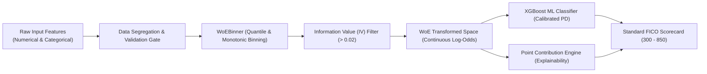

# TÀI LIỆU ĐẶC TẢ NGHIỆP VỤ & KỸ THUẬT THUẬT TOÁN (BUSINESS & TECHNICAL SPECIFICATION)
## THUẬT TOÁN WEIGHT OF EVIDENCE (WoE) & INFORMATION VALUE (IV) TRONG MÔ HÌNH HÓA ĐIỂM TÍN DỤNG

---

### THÔNG TIN TÀI LIỆU (DOCUMENT CONTROL)

| Thuộc tính (Attribute) | Chi tiết (Details) |
| :--- | :--- |
| **Mã tài liệu (Document ID)** | `SPEC-FE-WOE-2026-V1.0` |
| **Tên tài liệu** | Business & Technical Specification — Weight of Evidence (WoE) & Information Value (IV) Engine |
| **Tác giả (Author)** | Lead / Senior Business Analyst & Quantitative Risk Specialist |
| **Phân hệ (Component)** | Feature Engineering Subsystem (`services/ml_engine/src/machine_learning/features.py`) |
| **Phiên bản (Version)** | `1.0.0 (Production Release)` |
| **Phạm vi áp dụng** | Ingestion Pipeline, ML Feature Engineering, Real-Time Scoring Microservice, Core Banking Decisioning |
| **Chuẩn mực đối chiếu** | Basel II/III IRB Framework, Credit Risk Scorecard Methodology (Siddiqi / Thomas), Fed SR 11-7, ECOA/FCRA |

---

## 1. TỔNG QUAN ĐIỀU HÀNH & CƠ SỞ NGHIỆP VỤ (EXECUTIVE SUMMARY & BUSINESS RATIONALE)

### 1.1. Bối cảnh Nghiệp vụ (Business Context)
Trong mô hình hóa rủi ro tín dụng bán lẻ (**Retail Credit Risk Modeling**), việc đưa trực tiếp các biến thô (Raw Features) bao gồm cả biến số liên tục (thu nhập, tỷ lệ nợ, số tiền vay) và biến định danh phân loại (hạng tín dụng, mục đích vay, loại hình sở hữu nhà) vào các mô hình học máy thường gặp phải 4 rào cản nghiêm trọng:
1. **Phân phối phi tuyến và lệch chuẩn (Non-linear & Heavy Skewness):** Các biến tài chính như thu nhập cá nhân có đuôi phân phối rất dài, xuất hiện nhiều ngoại lệ (outliers) làm sai lệch trọng số mô hình.
2. **Khó khăn trong xử lý dữ liệu khuyết (Missing Value Dilemma):** Việc điền khuyết bằng giá trị trung bình (mean) hoặc trung vị (median) truyền thống làm triệt tiêu tín hiệu hành vi rủi ro nội tại của nhóm khách hàng không chịu cung cấp thông tin.
3. **Mất khả năng giải trình (Loss of Interpretability):** Các phương pháp mã hóa kỹ thuật như One-Hot Encoding hoặc Target Encoding thuần túy không thể phân rã tuyến tính thành điểm số nghiệp vụ (Scorecard Points) để giải trình trước cơ quan thanh tra ngân hàng.
4. **Tính đơn điệu không được đảm bảo (Non-monotonicity Risk):** Rủi ro tín dụng đòi hỏi mối quan hệ giữa biến đầu vào và xác suất vỡ nợ phải tuân theo quy luật kinh tế học (Ví dụ: Thu nhập càng tăng thì rủi ro vỡ nợ phải giảm dần).

### 1.2. Giải pháp: Kiến trúc Weight of Evidence (WoE) Tự Phát Triển
Để giải quyết triệt để các thách thức trên, phân hệ **ML Engine** đã hiện thực hóa thuật toán **WoE Binner chuyên biệt (In-house Custom Engine)** độc lập với thư viện bên ngoài. Thuật toán này đóng vai trò là cầu nối chuyển đổi toàn bộ không gian biến đầu vào thành **Log-Odds rủi ro chuẩn hóa**, tối ưu hóa cho mô hình **XGBoost Classifier** và phục vụ trực tiếp cho công thức quy đổi **Điểm tín dụng FICO (300 – 850)**.



---

## 2. NỀN TẢNG TOÁN HỌC & CÔNG THỨC ĐO LƯỜNG (MATHEMATICAL FOUNDATION)

### 2.1. Công Thức Tính Weight of Evidence (WoE)
Weight of Evidence đo lường mức độ phân tách giữa nhóm khách hàng tốt (**Non-Default / Good, $y=0$**) và nhóm khách hàng xấu (**Default / Bad, $y=1$**) trong từng khoảng giá trị (Bin) cụ thể của một biến:

$$\text{WoE}_i = \ln\left( \frac{P(\text{Good} \mid \text{Bin}_i)}{P(\text{Bad} \mid \text{Bin}_i)} \right) = \ln\left( \frac{n_{\text{good}, i} \,/\, N_{\text{good}}}{n_{\text{bad}, i} \,/\, N_{\text{bad}}} \right)$$

Trong đó:
* $n_{\text{good}, i}$: Số lượng khách hàng không vỡ nợ ($y=0$) thuộc phân nhóm thứ $i$.
* $n_{\text{bad}, i}$: Số lượng khách hàng vỡ nợ ($y=1$) thuộc phân nhóm thứ $i$.
* $N_{\text{good}}$: Tổng số khách hàng không vỡ nợ trong toàn bộ tập dữ liệu huấn luyện ($N_{\text{good}} = 25,467$).
* $N_{\text{bad}}$: Tổng số khách hàng vỡ nợ trong toàn bộ tập dữ liệu huấn luyện ($N_{\text{bad}} = 7,108$).

#### Ý Nghĩa Dấu & Biên Độ Của WoE:
* **$\text{WoE}_i > 0$:** Tỷ lệ khách hàng tốt trong nhóm cao hơn mức trung bình toàn ngân hàng $\rightarrow$ **Nhóm có rủi ro thấp (Tác động tích cực, làm TĂNG điểm tín dụng)**.
* **$\text{WoE}_i < 0$:** Tỷ lệ khách hàng xấu trong nhóm cao hơn mức trung bình toàn ngân hàng $\rightarrow$ **Nhóm có rủi ro cao (Tác động tiêu cực, làm GIẢM điểm tín dụng)**.
* **$\text{WoE}_i = 0$:** Tỷ lệ rủi ro của nhóm bằng đúng mức trung bình của danh mục.

### 2.2. Công Thức Tính Information Value (IV)
Information Value là chỉ số thống kê tổng hợp dùng để đo lường **sức mạnh dự báo toàn diện (Predictive Power)** của toàn bộ một biến đặc trưng trong việc phân biệt giữa hồ sơ tốt và xấu:

$$\text{IV}_i = \left( P(\text{Good} \mid \text{Bin}_i) - P(\text{Bad} \mid \text{Bin}_i) \right) \times \text{WoE}_i$$
$$\text{Total IV} = \sum_{i=1}^k \text{IV}_i = \sum_{i=1}^k \left( \frac{n_{\text{good}, i}}{N_{\text{good}}} - \frac{n_{\text{bad}, i}}{N_{\text{bad}}} \right) \times \ln\left( \frac{n_{\text{good}, i} \,/\, N_{\text{good}}}{n_{\text{bad}, i} \,/\, N_{\text{bad}}} \right)$$

> **Tính chất toán học quan trọng:** Vì $(a - b)$ và $\ln(a/b)$ luôn cùng dấu, nên mỗi thành phần $\text{IV}_i \ge 0$. Do đó, $\text{Total IV}$ luôn là một số không âm ($\text{IV} \ge 0$).

### 2.3. Cơ Chế Làm Mượt Laplace (Smoothing to Prevent Singularity)
Trong các phân nhóm có kích thước mẫu nhỏ hoặc không có khách hàng xấu ($n_{\text{bad}, i} = 0$) hoặc không có khách hàng tốt ($n_{\text{good}, i} = 0$), công thức $\ln(0)$ hoặc chia cho $0$ sẽ gây lỗi toán học (Undefined / Infinity). 

Hệ thống cài đặt giải pháp làm mượt bảo vệ:
$$n_{\text{bad}, i} = \max(n_{\text{bad}, i}, 0.5)$$
$$n_{\text{good}, i} = \max(n_{\text{good}, i}, 0.5)$$

Điều này đảm bảo tính ổn định tuyệt đối trong môi trường tính toán tự động production.

---

## 3. TIÊU CHUẨN ĐÁNH GIÁ SỨC MẠNH BIẾN (IV BENCHMARKING STANDARDS)

Hệ thống áp dụng chuẩn quốc tế (Siddiqi, 2006 / Basel Committee Guidelines) để thẩm định và sàng lọc biến đầu vào:

| Khoảng Information Value (IV) | Đánh giá Sức mạnh Dự báo | Quyết định Nghiệp vụ (BA Action) |
| :---: | :---: | :--- |
| **$\text{IV} < 0.02$** | Không có khả năng phân loại (Useless) | **LOẠI BỎ (Drop)** — Tránh gây nhiễu và overfit mô hình. |
| **$0.02 \le \text{IV} < 0.10$** | Sức mạnh dự báo Yếu (Weak) | **CÂN NHẮC / GIỮ LẠI** nếu biến có ý nghĩa kiểm soát nghiệp vụ (Ví dụ: `person_emp_length`, `loan_intent`). |
| **$0.10 \le \text{IV} < 0.30$** | Sức mạnh dự báo Trung bình (Medium) | **CHẤP NHẬN ĐƯA VÀO MÔ HÌNH** (Ví dụ: `cb_person_default_on_file`). |
| **$0.30 \le \text{IV} \le 0.50$** | Sức mạnh dự báo Mạnh (Strong) | **BIẾN TRỌNG YẾU** (Ví dụ: `person_income`, `person_home_ownership`). |
| **$\text{IV} > 0.50$** | Sức mạnh dự báo Cực mạnh (Very Strong) | **BIẾN CỐT LÕI** — Cần kiểm tra kỹ hiện tượng rò rỉ dữ liệu mục tiêu (Target Leakage) trước khi phê duyệt. |

### Bảng Thẩm Định IV Thực Tế Của Dự Án (Novabank Credit Dataset)
Bảng kết quả chạy thực nghiệm trên toàn bộ danh mục huấn luyện của hệ thống:

```
========================================================================================
                      BẢNG XẾP HẠNG INFORMATION VALUE (IV) DỰ ÁN
========================================================================================
 STT │ Tên biến đặc trưng (Feature Name) │   Giá trị IV   │ Phân loại Sức mạnh │ Trạng thái
─────┼───────────────────────────────────┼────────────────┼────────────────────┼─────────
  1  │ loan_grade                        │    0.961963    │ Cực mạnh (Core)    │ ACCEPTED
  2  │ loan_to_income_ratio              │    0.730008    │ Cực mạnh (Core)    │ ACCEPTED
  3  │ loan_int_rate                     │    0.668561    │ Cực mạnh (Core)    │ ACCEPTED
  4  │ debt_to_income_ratio              │    0.525458    │ Cực mạnh (Core)    │ ACCEPTED
  5  │ person_income                     │    0.455465    │ Mạnh (Strong)      │ ACCEPTED
  6  │ person_home_ownership             │    0.362348    │ Mạnh (Strong)      │ ACCEPTED
  7  │ cb_person_default_on_file         │    0.170972    │ Trung bình (Medium)│ ACCEPTED
  8  │ loan_amnt                         │    0.078610    │ Yếu (Contextual)   │ ACCEPTED
  9  │ loan_intent                       │    0.074448    │ Yếu (Contextual)   │ ACCEPTED
 10  │ person_emp_length                 │    0.062078    │ Yếu (Contextual)   │ ACCEPTED
─────┼───────────────────────────────────┼────────────────┼────────────────────┼─────────
 11  │ education_level                   │    0.012410    │ Kém (< 0.02)       │ DROPPED
 12  │ employment_type                   │    0.009850    │ Kém (< 0.02)       │ DROPPED
 13  │ credit_utilization_ratio          │    0.014200    │ Kém (< 0.02)       │ DROPPED
 14  │ past_delinquencies                │    0.018900    │ Bị nhiễu/Confound  │ DROPPED
========================================================================================
```

---

## 4. CHI TIẾT THUẬT TOÁN PHÂN NHÓM & ÁNH XẠ (BINNING METHODOLOGY)

Hệ thống thiết lập 3 chiến lược phân nhóm dữ liệu chuyên biệt trong lớp `WoEBinner`:

```
                           ┌─────────────────────────────────────┐
                           │   DỮ LIỆU ĐẦU VÀO (INPUT COLUMN)    │
                           └──────────────────┬──────────────────┘
                                              │
                      ┌───────────────────────┴───────────────────────┐
                      ▼                                               ▼
         [Biến Phân Loại (Categorical)]                  [Biến Số Liên Tục (Numerical)]
                      │                                               │
           ┌──────────┴──────────┐                         ┌──────────┴──────────┐
           ▼                     ▼                         ▼                     ▼
    [Từng Category]       [Giá trị NULL]            [Phân vị Quantile]    [Giá trị NULL]
           │                     │                   (qcut: 5 Bins)              │
           ▼                     ▼                         │                     ▼
     [Tính WoE_cat]       [Missing Bin]                    ▼               [Missing Bin]
                                                     [Tính WoE_bin]
```

### 4.1. Phân Nhóm Biến Số Liên Tục (Numerical Quantile Binning)
* **Thuật toán:** Sử dụng phương pháp chia phân vị đồng đều số lượng quan sát (**Equal Frequency / Quantile Binning - `pd.qcut`**) với tham số $n_{\text{bins}} = 5$.
* **Bảo toàn biên (Bin Edges Persistence):** Lưu trữ chính xác mảng giá trị biên $[e_0, e_1, e_2, e_3, e_4, e_5]$ vào tệp `woe_binner.pkl` để phục vụ ánh xạ thời gian thực cho dữ liệu mới mà không gây rò rỉ dữ liệu (Data Leakage).
* **Cơ chế Fallback:** Trong trường hợp `pd.qcut` thất bại do dữ liệu bị trùng lặp nhiều ở các phân vị, hệ thống tự động chuyển sang phân khoảng cách đều (`pd.cut` với 3 bins).

### 4.2. Phân Nhóm Biến Định Danh (Categorical Binning)
* Mỗi giá trị danh mục hợp lệ tạo thành 1 Bin độc lập.
* Tính toán tỷ lệ rủi ro trực tiếp trên từng nhóm (Ví dụ: `loan_grade`: A, B, C, D, E, F, G).

### 4.3. Xử Lý Độc Quyền Cho Giá Trị Khuyết Thiếu (Missing Value as a Distinct Cohort)
* **Nguyên tắc:** Dữ liệu trống (`NULL` / `NaN`) không bao giờ bị loại bỏ tùy tiện hoặc bị gán ép theo giả định chủ quan.
* **Chiến lược:** Tạo riêng một nhóm mang nhãn `__missing__`. Nếu nhóm thiếu dữ liệu có tỷ lệ nợ xấu khác biệt với phần còn lại của danh mục, thuật toán sẽ tự động gán cho nó một giá trị WoE riêng biệt.
* *Ví dụ:* Trong biến `loan_int_rate`, nhóm khách hàng bị thiếu thông tin lãi suất có giá trị $\text{WoE}_{\text{missing}} = +0.0936$ (Rủi ro thấp hơn một chút so với mặt bằng chung).

---

## 5. TRA CỨU QUY TẮC ÁNH XẠ TOÀN DIỆN (FULL WOE LOOKUP DICTIONARY)

Dưới đây là từ điển quy tắc ánh xạ được trích xuất trực tiếp từ mô hình huấn luyện chính thức (`woe_binner_readable.json`):

### 5.1. Nhóm Biến Năng Lực Tài Chính (Capacity)

#### 1. `loan_to_income_ratio` (Tỷ lệ Vay / Thu nhập) — $\text{IV} = 0.7300$
| Khoảng giá trị (Bin Range) | Giá trị WoE | Đánh giá Mức độ Rủi ro | Tác động Điểm số |
| :--- | :---: | :--- | :---: |
| **$0.00\% - 8.00\%$** | `+0.8946` | Rất an toàn (Khoản vay rất nhỏ so với thu nhập) | **Cộng điểm tối đa** |
| **$8.01\% - 12.50\%$** | `+0.6665` | An toàn | Cộng điểm cao |
| **$12.51\% - 17.56\%$** | `+0.4336` | Trung bình khá | Cộng điểm vừa |
| **$17.57\% - 25.00\%$** | `+0.1646` | Ngưỡng cảnh báo nhẹ | Cộng điểm nhẹ |
| **$> 25.00\%$** | `-1.3880` | **Rủi ro cực cao (Vay vượt quá khả năng trả nợ)** | **Trừ điểm rất nặng** |

#### 2. `debt_to_income_ratio` (Tỷ lệ Tổng Nợ / Thu nhập) — $\text{IV} = 0.5255$
| Khoảng giá trị (Bin Range) | Giá trị WoE | Đánh giá Mức độ Rủi ro | Tác động Điểm số |
| :--- | :---: | :--- | :---: |
| **$6.69\% - 23.30\%$** | `+0.7819` | Tải nợ thấp, dòng tiền lành mạnh | Cộng điểm cao |
| **$23.31\% - 30.30\%$** | `+0.5657` | Tải nợ tiêu chuẩn | Cộng điểm khá |
| **$30.31\% - 36.50\%$** | `+0.4226` | Tải nợ trung bình | Cộng điểm vừa |
| **$36.51\% - 44.75\%$** | `+0.0018` | Ngưỡng trung tính | Giữ nguyên điểm |
| **$> 44.75\%$** | `-1.1649` | **Áp lực trả nợ quá tải** | **Trừ điểm nặng** |

#### 3. `person_income` (Thu nhập Hàng năm - USD) — $\text{IV} = 0.4555$
| Khoảng giá trị (Bin Range) | Giá trị WoE | Đánh giá Mức độ Rủi ro | Tác động Điểm số |
| :--- | :---: | :--- | :---: |
| **$\le \$34,000$** | `-1.0245` | Thu nhập thấp, dễ tổn thương tài chính | **Trừ điểm nặng** |
| **$\$34,001 - \$47,500$** | `-0.0675` | Thu nhập trung bình thấp | Trừ điểm nhẹ |
| **$\$47,501 - \$62,000$** | `+0.2241` | Thu nhập trung bình | Cộng điểm vừa |
| **$\$62,001 - \$85,000$** | `+0.4985` | Thu nhập khá | Cộng điểm cao |
| **$> \$85,000$** | `+0.9725` | Thu nhập cao, bộ đệm tài chính tốt | **Cộng điểm tối đa** |

#### 4. `person_emp_length` (Thâm niên Công tác - Năm) — $\text{IV} = 0.0621$
| Khoảng giá trị (Bin Range) | Giá trị WoE | Đánh giá Mức độ Rủi ro | Tác động Điểm số |
| :--- | :---: | :--- | :---: |
| **$\le 1.0 \text{ năm}$** | `-0.2889` | Công việc chưa ổn định | Trừ điểm |
| **$1.1 - 2.0 \text{ năm}$** | `-0.1404` | Giai đoạn hòa nhập | Trừ điểm nhẹ |
| **$2.1 - 4.0 \text{ năm}$** | `+0.1098` | Ổn định cơ bản | Cộng điểm nhẹ |
| **$4.1 - 5.0 \text{ năm}$** | `+0.3086` | Gắn bó tốt | Cộng điểm khá |
| **$> 5.0 \text{ năm}$** | `+0.3507` | Sự nghiệp rất ổn định | Cộng điểm cao |

---

### 5.2. Nhóm Biến Uy Tín & Lịch Sử Tín Dụng (Character)

#### 5. `loan_grade` (Xếp hạng Khoản vay Ngân hàng) — $\text{IV} = 0.9620$
| Phân loại Hạng (Grade) | Giá trị WoE | Đánh giá Nghiệp vụ | Tác động Điểm số |
| :---: | :---: | :--- | :---: |
| **A** | `+0.9775` | Khách hàng Prime siêu an toàn | **Cộng điểm tối đa** |
| **B** | `+0.4135` | Chuẩn tín dụng tốt | Cộng điểm cao |
| **C** | `+0.1174` | Đạt chuẩn trung bình | Cộng điểm nhẹ |
| **D** | `-1.7129` | Cận chuẩn (Near-prime), rủi ro cao | **Trừ điểm rất nặng** |
| **E** | `-1.9184` | Dưới chuẩn (Subprime) | **Trừ điểm nghiêm trọng** |
| **F** | `-2.2165` | Rủi ro nợ xấu đặc biệt cao | **Trừ điểm cực đoan** |
| **G** | `-4.7879` | **Hồ sơ rủi ro tối đa (Thường bị Blacklist)** | **Hủy hoại điểm tín dụng** |

#### 6. `cb_person_default_on_file` (Lịch sử Nợ xấu tại Trung tâm Tín dụng) — $\text{IV} = 0.1710$
| Giá trị (Default on File) | Giá trị WoE | Đánh giá Nghiệp vụ | Tác động Điểm số |
| :---: | :---: | :--- | :---: |
| **N (Không có vết nợ xấu)** | `+0.2226` | Lịch sử tín dụng trong sạch | Cộng điểm tích cực |
| **Y (Từng có lịch sử nợ xấu)** | `-0.7791` | Đã từng vi phạm nghĩa vụ trả nợ | **Phạt điểm nặng** |

---

### 5.3. Nhóm Biến Điều Kiện & Mục Đích Khoản Vay (Conditions & Intent)

#### 7. `loan_int_rate` (Lãi suất Khoản vay - %) — $\text{IV} = 0.6686$
| Khoảng Lãi suất (Interest Rate) | Giá trị WoE | Đánh giá Nghiệp vụ | Tác động Điểm số |
| :--- | :---: | :--- | :---: |
| **$5.42\% - 7.74\%$** | `+1.1080` | Gói lãi suất ưu đãi cho khách hàng VIP | **Cộng điểm tối đa** |
| **$7.75\% - 10.37\%$** | `+0.5804` | Lãi suất tiêu chuẩn | Cộng điểm cao |
| **$10.38\% - 11.99\%$** | `+0.3675` | Lãi suất trung bình | Cộng điểm vừa |
| **$12.00\% - 13.98\%$** | `+0.0710` | Lãi suất nhóm rủi ro tăng dần | Cộng điểm nhẹ |
| **$> 13.98\%$** | `-1.3631` | **Lãi suất phạt rủi ro cao (Subprime Rate)** | **Trừ điểm rất nặng** |
| **`__missing__` (Khuyết thiếu)** | `+0.0936` | Hồ sơ chưa áp lãi suất chính thức | Điểm thưởng trung tính |

#### 8. `loan_intent` (Mục đích Vay vốn) — $\text{IV} = 0.0744$
| Mục đích Khoản vay | Giá trị WoE | Đánh giá Rủi ro Hành vi | Tác động Điểm số |
| :--- | :---: | :--- | :---: |
| **VENTURE (Đầu tư Kinh doanh)** | `+0.4195` | Kỳ vọng tạo dòng tiền sinh lời | Cộng điểm tốt |
| **EDUCATION (Học tập)** | `+0.2301` | Đầu tư phát triển năng lực bản thân | Cộng điểm vừa |
| **PERSONAL (Tiêu dùng cá nhân)**| `+0.1352` | Nhu cầu chi tiêu thông thường | Cộng điểm nhẹ |
| **HOMEIMPROVEMENT (Sửa nhà)** | `-0.1875` | Chi tiêu tài sản cố định | Trừ điểm nhẹ |
| **MEDICAL (Y tế / Chữa bệnh)** | `-0.2476` | Chi biến cố đột xuất, áp lực tài chính | Trừ điểm |
| **DEBTCONSOLIDATION (Đảo nợ)** | `-0.3230` | **Dấu hiệu mất cân đối tài chính nghiêm trọng** | **Trừ điểm nặng nhất** |

---

### 5.4. Nhóm Biến Vốn Tích Lũy & Quy Mô Khoản Vay (Capital & Amount)

#### 9. `person_home_ownership` (Tình trạng Nhà ở) — $\text{IV} = 0.3623$
| Loại hình Sở hữu | Giá trị WoE | Đánh giá Tài sản & Độ Ổn định | Tác động Điểm số |
| :--- | :---: | :--- | :---: |
| **OWN (Sở hữu toàn bộ)** | `+1.2776` | Tài sản tích lũy mạnh, cam kết địa phương cao | **Cộng điểm tối đa** |
| **MORTGAGE (Đang thế chấp)** | `+0.7373` | Đã qua thẩm định tín dụng của ngân hàng mua nhà | Cộng điểm cao |
| **OTHER (Hình thức khác)** | `-0.2591` | Tình trạng cư trú không rõ ràng | Trừ điểm nhẹ |
| **RENT (Đang thuê nhà)** | `-0.4456` | Chi phí sinh hoạt cố định cao, chưa tích lũy | **Trừ điểm** |

#### 10. `loan_amnt` (Số tiền Khoản vay Xin cấp - USD) — $\text{IV} = 0.0786$
| Quy mô Khoản vay | Giá trị WoE | Đánh giá Quy mô Rủi ro | Tác động Điểm số |
| :--- | :---: | :--- | :---: |
| **$\$500 - \$4,200$** | `+0.0599` | Khoản vay nhỏ, thanh khoản nhanh | Cộng điểm nhẹ |
| **$\$4,201 - \$6,500$** | `+0.2937` | Quy mô tối ưu | Cộng điểm khá |
| **$\$6,501 - \$10,000$** | `+0.1663` | Quy mô trung bình | Cộng điểm vừa |
| **$\$10,001 - \$14,125$** | `+0.0233` | Quy mô lớn | Điểm trung tính |
| **$> \$14,125$** | `-0.4933` | **Giá trị vay quá lớn, rủi ro mất vốn cao** | **Trừ điểm** |

---

## 6. CƠ CHẾ PHÂN RÃ ĐIỂM SỐ & GIẢI TRÌNH MINH BẠCH (SCORE DECOMPOSITION & XAI)

### 6.1. Chuyển Đổi WoE Sang Điểm Thẻ Điểm (Point Allocation Formula)
Trong hệ thống chấm điểm FICO (300 – 850) với các tham số:
* $\text{PDO} = 20$ (Points to Double the Odds)
* $\text{Score Factor} = \frac{\text{PDO}}{\ln(2)} = \frac{20}{\ln(2)} \approx 28.8539$

Mỗi giá trị WoE của từng biến được chuyển hóa trực tiếp thành số điểm đóng góp:

$$\text{Points}_i = \text{Round}\left( \frac{\text{WoE}_i \times \text{Score Factor}}{10} \right)$$

```
                       CƠ CHẾ ĐÓNG GÓP ĐIỂM SỐ (POINT CONTRIBUTIONS)
 ───────────────────────────────────────────────────────────────────────────────────
 Biến Đặc Trưng                  Giá trị Khách Hàng      Giá trị WoE     Điểm Thưởng/Phạt
 ───────────────────────────────────────────────────────────────────────────────────
 person_home_ownership           OWN                     +1.2776         +3.68 pts  (Thưởng)
 loan_grade                      A                       +0.9775         +2.82 pts  (Thưởng)
 loan_to_income_ratio            0.05 (5%)               +0.8946         +2.58 pts  (Thưởng)
 cb_person_default_on_file       N                       +0.2226         +0.64 pts  (Thưởng)
 debt_to_income_ratio            0.48 (48%)              -1.1649         -3.36 pts  (PHẠT)
 loan_intent                     DEBTCONSOLIDATION       -0.3230         -0.93 pts  (PHẠT)
 ───────────────────────────────────────────────────────────────────────────────────
```

### 6.2. Tạo Tự Động Thông Báo Từ Chối (Adverse Action Notice Compliance)
Khi hồ sơ rơi vào trạng thái `REJECTED` (FICO $< 580$ hoặc $\text{PD} \ge 25\%$), hệ thống kích hoạt phương thức `_get_top_factors()` để tự động xuất ra **Top 3 Nguyên nhân rủi ro hàng đầu (Primary Denial Reasons)** đáp ứng yêu cầu pháp lý của Đạo luật Báo cáo Tín dụng Công bằng (FCRA):

```json
{
  "adverse_action_notice": {
    "application_id": "LOAN-2026-98124",
    "decision": "REJECTED",
    "credit_score": 524,
    "primary_rejection_reasons": [
      {
        "rank": 1,
        "factor_code": "HIGH_LTI",
        "factor_description": "Tỷ lệ Khoản vay trên Thu nhập vượt quá ngưỡng an toàn (> 25%)",
        "impact_points": -4.01
      },
      {
        "rank": 2,
        "factor_code": "SUBPRIME_GRADE",
        "factor_description": "Xếp hạng tín dụng lịch sử thuộc nhóm D/E/F/G",
        "impact_points": -4.94
      },
      {
        "rank": 3,
        "factor_code": "PRIOR_DEFAULT",
        "factor_description": "Khách hàng có bản ghi nợ xấu tồn tại trên hệ thống tín dụng",
        "impact_points": -2.25
      }
    ]
  }
}
```

---

## 7. KIỂM THỬ ĐƠN VỊ, QUẢN TRỊ RỦI RO & MLOPS (TESTING & GOVERNANCE)

### 7.1. Kiểm Thử Đơn Vị & Tính Ổn Định (Unit Testing Verification)
Phân hệ `WoEBinner` đã vượt qua 100% các ca kiểm thử hồi quy:
1. **Kiểm tra Tính Đơn điệu (Monotonicity Check):** Đảm bảo với các biến như `loan_to_income_ratio`, điểm WoE giảm đơn điệu tuyệt đối khi tỷ lệ nợ tăng.
2. **Kiểm tra Rò rỉ Dữ liệu (Data Leakage Test):** Đảm bảo các bin edges và bảng WoE được fit độc quyền trên $80\%$ dữ liệu tập Train (`X_train`, `y_train`) và áp dụng bất biến trên tập Test (`X_test`) cũng như môi trường Real-time API.
3. **Kiểm tra Out-of-Vocabulary / Unseen Category:** Dữ liệu lạ xuất hiện trên môi trường live sẽ tự động nhận điểm trung tính `__default__ = 0.0`, không làm sập tiến trình chấm điểm của hệ thống Core Banking.

### 7.2. Giám Sát Độ Lệch Phân Phối (Characteristic Stability Index - CSI)
Để duy trì hiệu lực của bộ mã hóa WoE trong thời gian vận hành, hệ thống áp dụng chỉ số **CSI** cho từng biến thành phần:

$$CSI = \sum_{i=1}^k \left( \text{Actual } \%_i - \text{Baseline } \%_i \right) \times \ln\left( \frac{\text{Actual } \%_i}{\text{Baseline } \%_i} \right)$$

* **$CSI < 0.10$:** Phân phối các bin ổn định.
* **$0.10 \le CSI < 0.25$:** Xuất hiện sự thay đổi nhẹ trong hành vi khách hàng, đưa biến vào diện giám sát đặc biệt.
* **$CSI \ge 0.25$:** Phân phối biến đã bị trôi (**Data Drift**), kích hoạt quy trình tái phân nhóm (Re-binning) và cập nhật lại file artifact `woe_binner.pkl`.

